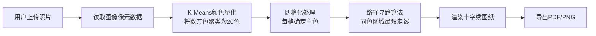

## 1. 产品概述

十字绣图纸生成工具是一个基于Web的图像处理应用，用户可以上传任意照片，系统将自动将图像转换为十字绣刺绣图纸。核心功能包括：照片上传、颜色量化（将数万种颜色聚类为20种标准刺绣线色）、穿线路径寻路算法（计算同色区域最短走线路径）、以及最终图纸导出。

- 目标用户：手工爱好者、十字绣从业者、设计师
- 核心价值：将复杂图像自动转换为可执行的刺绣方案，节省人工配色和走线规划时间

## 2. 核心功能

### 2.1 功能模块
1. **主页/工作台**：照片上传、参数配置、实时预览、图纸导出
2. **颜色量化引擎**：K-Means聚类算法，将图像颜色量化为20种刺绣线色
3. **路径寻路算法**：TSP近似算法，计算同色区域最短穿线路径
4. **图纸渲染**：将量化后的图像以网格方式渲染，显示颜色编号和走线方向

### 2.2 页面详情

| 页面名称 | 模块名称 | 功能描述 |
|---------|---------|---------|
| 工作台 | 照片上传区 | 拖拽/点击上传照片，支持JPG/PNG格式，预览原图 |
| 工作台 | 参数配置面板 | 设置网格尺寸（如100x100, 200x200）、选择刺绣色系（默认DMC标准20色）、显示选项切换 |
| 工作台 | 实时预览区 | 左右分栏对比：原图 vs 十字绣效果；放大查看网格细节 |
| 工作台 | 颜色统计面板 | 显示20种颜色的使用统计，包括线号、RGB值、使用针数、预计线长 |
| 工作台 | 走线图面板 | 显示每种颜色的走线路径，数字标注穿线顺序 |
| 工作台 | 导出功能 | 导出PDF图纸（含颜色图例、网格图、走线指引）、导出PNG预览图 |

## 3. 核心流程

用户上传照片 → 系统读取像素数据 → 颜色量化聚类（K-Means将所有像素颜色收敛到20个刺绣线色） → 网格化处理（将图像按指定尺寸划分网格，每格取主色） → 路径寻路（对同色区域计算最短穿线路径） → 渲染显示图纸 → 用户导出图纸

## 4. 用户界面设计

### 4.1 设计风格
- 主色调：深蓝 #1e3a5f（专业感）+ 金色 #d4a574（工艺感）
- 辅助色：中性灰系列，保证图纸清晰可读
- 按钮风格：圆角矩形，悬停有微动画
- 字体：Inter（正文）+ JetBrains Mono（数字/线号显示）
- 布局：三栏式布局（左侧控制面板 + 中央预览区 + 右侧颜色/走线面板）
- 图标：lucide-react线性图标

### 4.2 页面设计概览

| 页面名称 | 模块名称 | UI元素 |
|---------|---------|--------|
| 工作台 | 上传区 | 大尺寸拖拽框，虚线边框，悬停高亮，显示文件格式提示 |
| 工作台 | 参数面板 | 滑块控制网格尺寸，下拉选择色系，开关控制显示选项 |
| 工作台 | 预览区 | 左右分栏对比视图，悬停放大，网格线显示切换 |
| 工作台 | 颜色面板 | 颜色方块+线号+使用量列表，点击可高亮对应区域 |
| 工作台 | 走线面板 | 迷你缩略图，同色连线显示，数字标注 |

### 4.3 响应式设计
- 桌面端优先设计（≥1024px）
- 平板端（768-1024px）：两栏布局，参数面板折叠为抽屉
- 移动端（<768px）：单栏堆叠，重要功能优先显示
