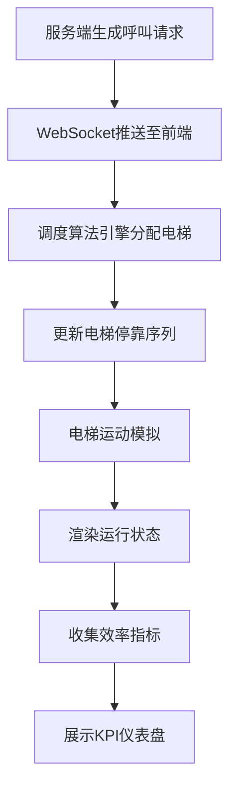

## 1. 产品概述

大厦电梯群控调度可视化看板，模拟高层楼宇10部电梯的智能调度系统。服务端每秒模拟生成数百人的楼层呼叫请求，前端实现智能调度算法，动态渲染电梯运行状态，验证不同调度策略的接人效率。

## 2. 核心功能

### 2.1 功能模块

1. **实时监控看板**：电梯运行状态可视化、楼层呼叫热力图、统计数据面板
2. **调度算法引擎**：支持多种调度策略（先来先服务、最短寻道、顺路捎带、潮汐优化）
3. **请求模拟服务**：每秒生成数百个楼层上下楼呼叫请求，支持早晚高峰模式
4. **效率评估系统**：平均等待时间、平均行程时间、电梯利用率、拥堵指数等KPI

### 2.2 页面详情

| 页面名称 | 模块名称 | 功能描述 |
|-----------|-------------|---------------------|
| 主看板 | 电梯运行视图 | 10部电梯实时位置、方向、载客量可视化 |
| 主看板 | 楼层呼叫面板 | 各楼层呼叫请求数量热力图、等待人数统计 |
| 主看板 | 调度控制台 | 算法选择、参数调节、启停控制 |
| 主看板 | 效率仪表盘 | 实时KPI曲线、历史数据对比、效率评分 |

## 3. 核心流程

## 4. 用户界面设计

### 4.1 设计风格
- **主色调**：科技蓝 #00D4FF 搭配深空灰 #0A0E17
- **辅助色**：运行绿 #00FF88、警告橙 #FF8800、告警红 #FF3366
- **字体**：JetBrains Mono 等宽字体展示数据，Inter 展示说明文字
- **视觉风格**：赛博朋克/科技仪表盘风格，深色主题，霓虹光效
- **动画**：电梯运动平滑过渡，数据更新微动画，状态变化发光效果

### 4.2 页面设计

| 页面名称 | 模块名称 | UI元素 |
|-----------|-------------|-------------|
| 主看板 | 电梯井道视图 | 30层楼垂直布局，10条电梯井道，电梯轿厢动态移动 |
| 主看板 | 楼层状态条 | 每层楼显示上下行呼叫按钮状态，等待人数徽章 |
| 主看板 | 控制面板 | 算法选择下拉框、模拟速度滑块、启停按钮 |
| 主看板 | 数据仪表盘 | 实时曲线图、环形进度图、数字跳动效果 |

### 4.3 响应式
- 桌面端优先，支持1920px以上分辨率
- 三栏布局：左侧电梯视图、中间楼层面板、右侧数据仪表盘
- 自适应缩放，支持全屏展示
