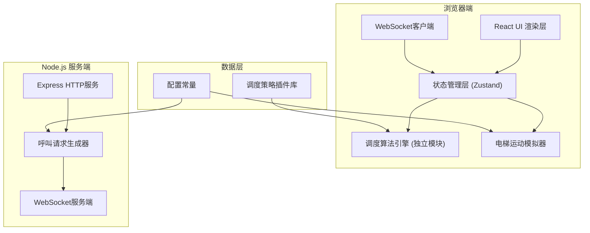

## 1. 架构设计



## 2. 技术描述

- **前端**：React 18 + TypeScript + TailwindCSS 3 + Vite
- **后端**：Express 4 + WebSocket (ws库)
- **状态管理**：Zustand
- **图表**：Recharts
- **通信**：WebSocket 实时推送
- **动画**：Framer Motion

## 3. 目录结构

```
src/
├── components/          # UI组件
│   ├── ElevatorShaft.tsx      # 电梯井道
│   ├── ElevatorCar.tsx        # 电梯轿厢
│   ├── FloorPanel.tsx         # 楼层面板
│   ├── ControlPanel.tsx       # 控制面板
│   └── KPIDashboard.tsx       # 数据仪表盘
├── store/               # 状态管理
│   └── elevatorStore.ts
├── scheduler/           # 调度算法（隔离模块）
│   ├── index.ts
│   ├── types.ts
│   ├── FCFS.ts               # 先来先服务
│   ├── SSTF.ts               # 最短寻道
│   ├── SCAN.ts               # 扫描算法
│   └── SmartDispatch.ts      # 智能顺路捎带
├── simulator/           # 模拟器
│   ├── ElevatorSimulator.ts
│   └── RequestGenerator.ts
├── types/               # 类型定义
│   └── index.ts
└── utils/               # 工具函数
    └── performance.ts
```

## 4. 核心数据结构

### 4.1 电梯状态

```typescript
interface Elevator {
  id: number;
  currentFloor: number;
  targetFloors: number[];  // 停靠序列
  direction: 'up' | 'down' | 'idle';
  state: 'moving' | 'door-open' | 'idle';
  passengers: number;
  capacity: number;
  doorTimer: number;
}
```

### 4.2 呼叫请求

```typescript
interface CallRequest {
  id: string;
  floor: number;
  direction: 'up' | 'down';
  timestamp: number;
  waitTime: number;
  assignedElevator: number | null;
  picked: boolean;
}
```

### 4.3 调度算法接口

```typescript
interface Scheduler {
  name: string;
  dispatch(
    elevators: Elevator[],
    calls: CallRequest[],
    buildingConfig: BuildingConfig
  ): DispatchResult[];
}

interface DispatchResult {
  elevatorId: number;
  addTargetFloor: number;
}
```

## 5. 服务端API

### 5.1 WebSocket消息

```typescript
// 服务端 -> 客户端: 新呼叫请求
{
  type: 'NEW_CALLS',
  payload: CallRequest[]
}

// 客户端 -> 服务端: 效率数据上报
{
  type: 'METRICS_REPORT',
  payload: PerformanceMetrics
}
```

## 6. 潮汐拥堵模拟策略

- **早高峰模式**：70%请求从1楼上行，30%各楼层间流动
- **晚高峰模式**：70%请求从各楼层下行到1楼
- **平峰模式**：各楼层均匀随机分布
- **楼层热度**：1楼、10楼、20楼、30楼作为热门楼层，请求量翻倍
