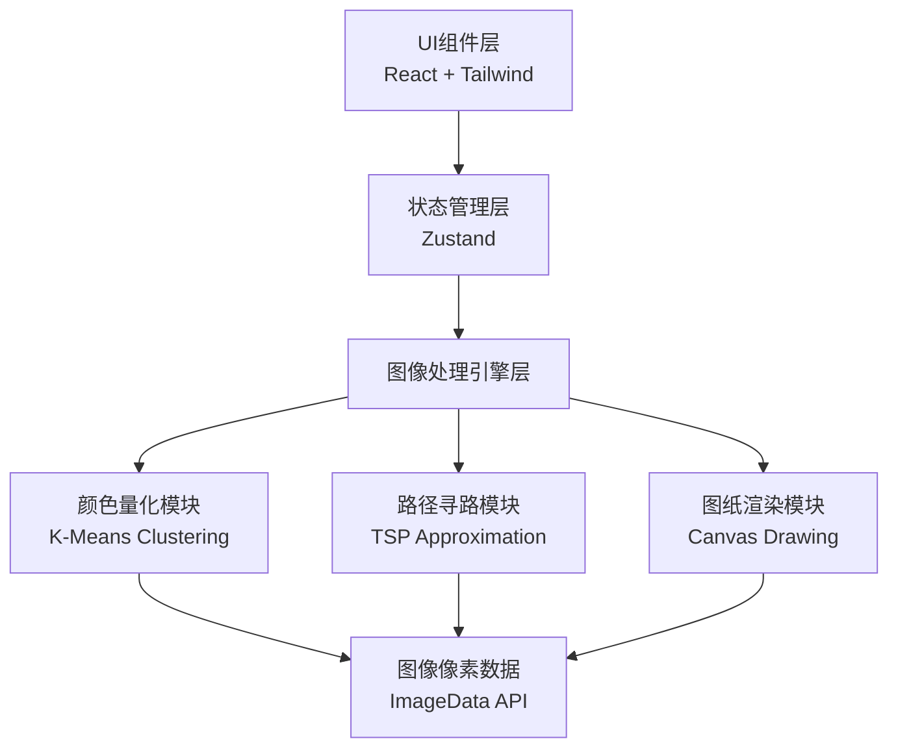

## 1. 架构设计

纯前端应用，所有图像处理在浏览器端完成，无需后端服务。算法模块与UI组件完全解耦。



## 2. 技术说明

- 前端：React@18 + TypeScript + Tailwind CSS@3 + Vite
- 初始化工具：vite-init
- 后端：无（纯前端应用）
- 状态管理：Zustand
- 图像处理：Canvas API + 自定义算法
- 导出：jsPDF（PDF导出）+ Canvas toDataURL（PNG导出）

## 3. 路由定义

| 路由 | 用途 |
|-----|------|
| / | 工作台主页面，所有功能集中 |

## 4. 核心算法模块

### 4.1 颜色量化算法 (colorQuantizer.ts)

**K-Means聚类算法**
- 输入：ImageData（所有像素的RGB值）
- 输出：20个聚类中心（刺绣线色）+ 每个像素的颜色索引
- 步骤：
  1. 将所有像素RGB值转换为LAB颜色空间（更符合人眼感知）
  2. 初始化20个聚类中心（K-Means++策略或均匀采样）
  3. 迭代计算：分配像素到最近中心 → 更新中心位置 → 直到收敛
  4. 将聚类中心映射回RGB空间
  5. 输出每个像素的颜色索引（0-19）

### 4.2 路径寻路算法 (pathFinder.ts)

**贪心TSP近似算法**
- 输入：网格化后的颜色矩阵（每格一个颜色索引）
- 输出：每种颜色的穿线路径（有序坐标列表）
- 步骤：
  1. 对每种颜色，收集所有该颜色的网格坐标
  2. 使用最近邻算法（Nearest Neighbor）计算初始路径
  3. 使用2-opt优化算法改进路径（减少交叉）
  4. 计算总路径长度和穿线次数

### 4.3 图像网格处理器 (gridProcessor.ts)

- 将原始图像按指定尺寸（如100x100）分割
- 每个网格区域计算主色（出现频率最高的量化颜色）
- 输出颜色矩阵（二维数组）+ 颜色频率统计

## 5. 项目结构

```
src/
├── components/          # UI组件
│   ├── UploadArea.tsx       # 照片上传区
│   ├── ControlPanel.tsx     # 参数控制面板
│   ├── PreviewCanvas.tsx    # 预览画布
│   ├── ColorPanel.tsx       # 颜色统计面板
│   ├── PathPanel.tsx        # 走线面板
│   └── ExportPanel.tsx      # 导出面板
├── hooks/               # 自定义Hooks
│   └── useCrossStitch.ts    # 十字绣处理主Hook
├── utils/               # 工具函数
│   ├── colorQuantizer.ts    # 颜色量化算法
│   ├── pathFinder.ts        # 路径寻路算法
│   ├── gridProcessor.ts     # 网格处理器
│   ├── colorSpace.ts        # 颜色空间转换（RGB↔LAB）
│   └── exporters.ts         # 导出工具
├── data/                # 数据
│   └── flossColors.ts       # 刺绣线色数据
├── store/               # 状态管理
│   └── appStore.ts          # Zustand Store
├── types/               # 类型定义
│   └── index.ts             # 类型声明
├── App.tsx              # 主应用组件
└── main.tsx             # 入口文件
```

## 6. 数据模型

### 6.1 类型定义

```typescript
// 像素颜色
interface RGB { r: number; g: number; b: number }
interface LAB { L: number; a: number; b: number }

// 刺绣线色
interface FlossColor {
  id: string           // 线号，如 "DMC 310"
  name: string         // 颜色名称
  rgb: RGB             // RGB值
  lab: LAB             // LAB值
}

// 量化结果
interface QuantizeResult {
  palette: FlossColor[]     // 20色调色板
  colorMap: number[][]      // 每个像素的颜色索引
}

// 网格结果
interface GridResult {
  gridSize: number          // 网格尺寸（如100表示100x100）
  colorMatrix: number[][]   // 每格的颜色索引
  colorCounts: Map<number, number>  // 每种颜色的使用次数
}

// 路径结果
interface PathResult {
  colorIndex: number        // 颜色索引
  path: [number, number][]  // 有序坐标列表
  totalLength: number       // 总路径长度
}

// 应用状态
interface AppState {
  originalImage: ImageData | null
  quantizeResult: QuantizeResult | null
  gridResult: GridResult | null
  paths: PathResult[]
  settings: {
    gridSize: number
    showGridLines: boolean
    showColorNumbers: boolean
    showPathArrows: boolean
  }
}
```
